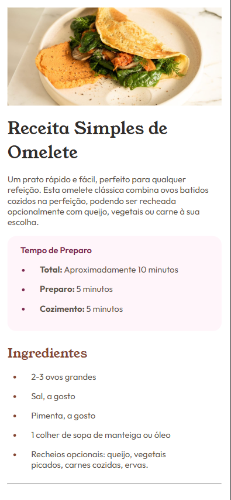
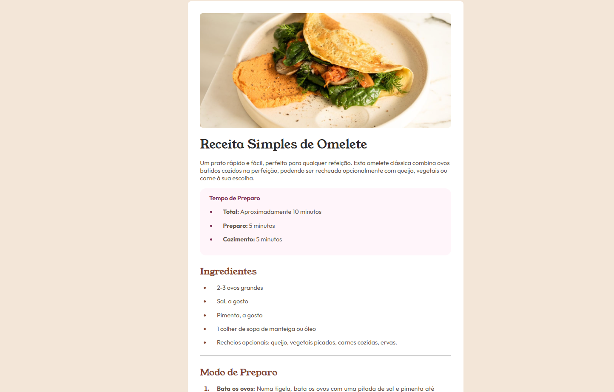

<h1 align="center"> Frontend Mentor - Solução Página de Receita </h1>

Essa é uma solução para o [Desafio Página de receita no Frontend Mentor](https://www.frontendmentor.io/challenges/recipe-page-KiTsR8QQKm). Os desafios do Frontend Mentor ajudam você a aprimorar suas habilidades de programação por meio da criação de projetos realistas.

    

## 💻 Projeto

Este projeto é uma página de receita de uma omelete simples

## 🚀 Tecnologias

Esse projeto foi desenvolvido com as seguintes tecnologias:

- HTML
- CSS
- Git e GitHub

### O Que Aprendi

- Organização e Estruturação de HTML semântico
- Uso de variáveis CSS
- Alinhamento com Display Block, Display in-line e Display Flex.

### Links

- URL da Solução: 
- URL do Site: 

## Screenshot do resultado

### Versão Mobile

 
    

### Versão Desktop

    

## Autor

- Website - [Antônio Rafael]()
- Frontend Mentor - [@yourusername](https://www.frontendmentor.io/profile/Antonio-Rafael-Silva)
- Linkedin - [Antônio Rafael](https://www.linkedin.com/in/ant%C3%B4nio-rafael-01131b372/)